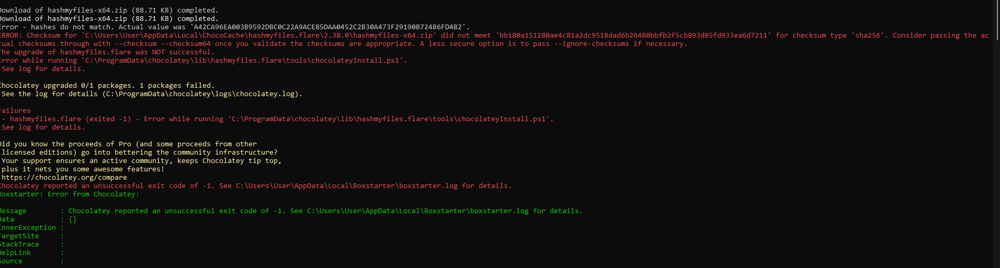
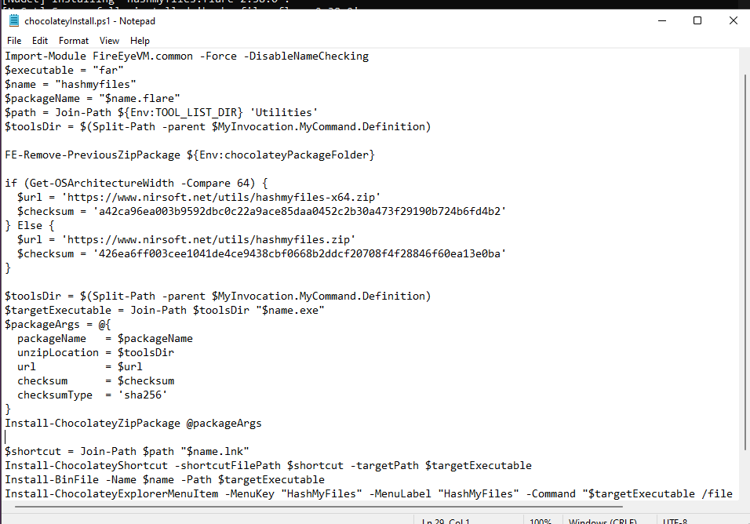
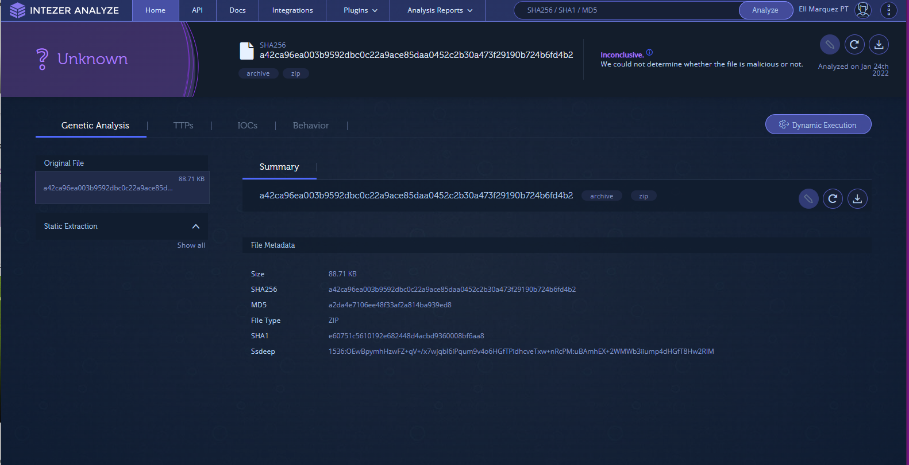
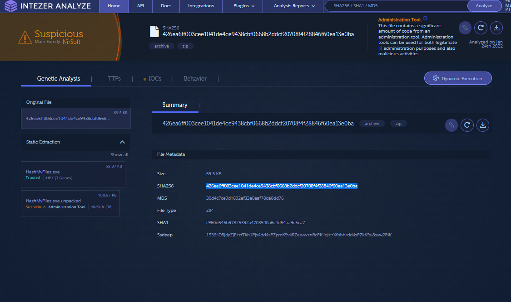

# Hash My File Install Issue: 
Checksums in launch script are no longer valid.  



## Install Script Location
    - C:\ProgramData\chocolatey\lib-bad\hashmyfiles.flare\tools



## New Hashes:

* hashmyfiles-x64.zip
```a42ca96ea003b9592dbc0c22a9ace85daa0452c2b30a473f29190b724b6fd4b2```


* hashmyfiles.zip    ```426ea6ff003cee1041de4ce9438cbf0668b2ddcf20708f4f28846f60ea13e0ba```



